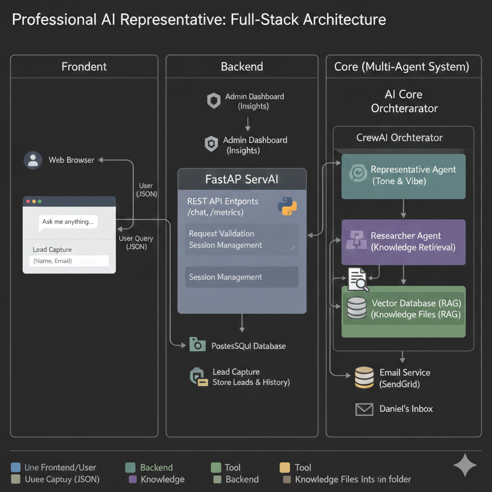

# Professional Representative Agent (MVP)

Chatbot that acts as Daniel David's professional gatekeeper: represents his public persona, answers from a fixed knowledge base, and captures leads when it cannot answer (e.g. salary, private details) via SendGrid.

## Setup

1. **Env**  
   Copy `.env.example` to `.env` and set:
   - Azure: `AZURE_OPENAI_API_KEY`, `AZURE_OPENAI_ENDPOINT`, `AZURE_OPENAI_API_VERSION`, `AZURE_OPENAI_DEPLOYMENT_NAME`
   - SendGrid: `SENDGRID_API_KEY`, `EMAIL_FROM` (verified sender), `EMAIL_TO` (Daniel’s inbox)
   - **Tracing (optional):** To see traces at https://platform.openai.com/traces, add your **direct** OpenAI API key (from platform.openai.com, not Azure): `OPENAI_API_KEY=sk-...`. The chatbot still uses Azure for the LLM; this key is only used to upload trace data.

   **Microsoft Foundry:** Use the **Foundry** endpoint, not the classic one:
   - `AZURE_OPENAI_ENDPOINT=https://<your-resource>.services.ai.azure.com` (e.g. `https://daniel-ai-agents-resource.services.ai.azure.com`)
   - `AZURE_OPENAI_API_VERSION=2024-10-21`
   - In the portal: **Models + endpoints** (or **Model catalog**) → create a deployment → set `AZURE_OPENAI_DEPLOYMENT_NAME` to that deployment’s exact name.

2. **Install**  
   `pip install -r requirements.txt`

3. **Run locally**  
   From this project folder:
   ```bash
   python main.py
   ```
   Chat in the terminal. Type `exit`, `quit`, or `bye` to stop.

## Knowledge directory

Put anything about you in **`knowledge/`**: drop `.txt` or `.md` files (resume, bio, FAQs). The agent loads them at startup and uses that context to answer. It does not use `knowledge/README.md` (that file is only for instructions).

## Structure

- **main.py** – Entry point; wires Azure, loads `knowledge/`, runs the chat loop. Handles connection errors with a clear message.
- **tools.py** – `LeadCapture` (Pydantic), `send_html_email` (SendGrid), `lead_capture` (@function_tool).
- **agent_config.py** – System instructions (including content from `knowledge/`) and `create_agent()`.
- **knowledge_loader.py** – Reads all `.txt`/`.md` from `knowledge/` for the agent.
- **azure_utils.py** – Async Azure client and `set_default_openai_api("chat_completions")` for the Agents SDK.

### Architecture Overview

