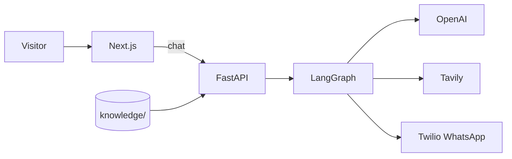
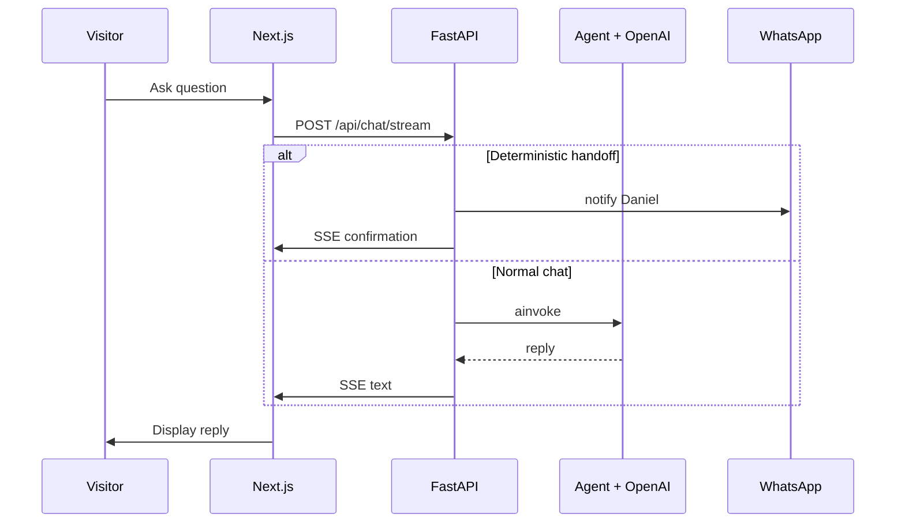

# Professional AI Representative

Daniel David's professional AI gatekeeper — a Next.js portfolio site with a LangGraph-powered chat agent that answers from a knowledge base, searches the public web with Tavily, and notifies Daniel on WhatsApp when it cannot answer.


## What it does

- **Public persona** — Answers questions about Daniel's background, skills, and projects from files in `knowledge/`.
- **Web retrieval** — Uses **Tavily** to search the public internet for current events and general facts.
- **Missing-info protocol** — When unsure about Daniel personally (salary, private details, etc.), collects name + email and notifies Daniel via **Twilio WhatsApp**.
- **Full-stack deployment** — Next.js frontend and FastAPI backend, both deployable on Vercel.

## Live stack

| Layer | Tech |
|-------|------|
| Frontend | Next.js 16, Tailwind CSS |
| Backend | FastAPI, LangGraph, LangChain OpenAI |
| LLM | OpenAI API (`gpt-4o-mini`) |
| Web search | Tavily |
| Lead alerts | Twilio WhatsApp |
| Knowledge | `knowledge/` — `.txt`, `.md`, `.pdf` loaded at startup |

## Architecture

### System overview


```mermaid
flowchart LR
    Visitor --> FE[Next.js]
    FE -->|chat| API[FastAPI]
    Knowledge[(knowledge/)] --> API
    API --> Agent[LangGraph]
    Agent --> OpenAI
    Agent --> Tavily
    Agent --> WhatsApp[Twilio WhatsApp]
```

### Agent unit + all context sources

Chat memory lives in the browser. Each request sends the full history. Knowledge is baked into the system prompt at startup — it is not chat memory.

```mermaid
flowchart TB
    Browser[Browser — localStorage history] -->|messages[]| API[FastAPI]
    Knowledge[(knowledge/)] -->|system prompt| Agent
    API -->|email + question| WhatsApp[Twilio WhatsApp]
    API -->|otherwise| Agent[LangGraph + GPT-4o-mini]
    Agent -->|public facts| Tavily
    Agent -->|lead| WhatsApp
    Agent --> Reply
```

### Chat request flow


```mermaid
sequenceDiagram
    participant U as Visitor
    participant FE as Next.js
    participant BE as FastAPI
    participant Agent as Agent + OpenAI
    participant WA as WhatsApp

    U->>FE: Ask question
    FE->>BE: POST /api/chat/stream
    alt Deterministic handoff
        BE->>WA: notify Daniel
        BE->>FE: SSE confirmation
    else Normal chat
        BE->>Agent: ainvoke
        Agent-->>BE: reply
        BE->>FE: SSE text
    end
    FE->>U: Display reply
```

## Quick start (local)

See **[DEVELOPER_INSTRUCTIONS.md](DEVELOPER_INSTRUCTIONS.md)** for the full guide.

```bash
# Backend
python3 -m venv .venv && source .venv/bin/activate
pip install -r requirements.txt
cp .env.example .env   # fill in OPENAI_API_KEY, Twilio, and Tavily vars
uvicorn backend.app:app --host 0.0.0.0 --port 8000

# Frontend (separate terminal)
cd frontend && npm install && npm run dev
```

Open `http://localhost:3000/chat`.

## Configuration smoke test

There is **no email notification** in production. Contact-form and chat leads go to **WhatsApp** via Twilio (`TWILIO_WHATSAPP_TO`).

Run a live check of every project config (env presence + OpenAI, Tavily, WhatsApp send, knowledge, agent):

- **Developer panel:** `http://localhost:3000/dev` → **Run smoke test**. This sends a real WhatsApp test message.
- **API:** `POST /api/dev/smoke` (same auth as the panel: `X-Dev-Panel-Secret` when `DEV_PANEL_SECRET` is set)

```bash
curl -X POST http://localhost:8000/api/dev/smoke \
  -H "X-Dev-Panel-Secret: $DEV_PANEL_SECRET"
```

Restart the API after backend changes, then run the smoke test before assuming Twilio/OpenAI/Tavily are working.

## Environment variables

Copy `.env.example` to `.env` at the repo root:

| Variable | Where | Purpose |
|----------|-------|---------|
| `OPENAI_API_KEY` | Backend | LLM calls |
| `OPENAI_MODEL` | Backend | Optional, default `gpt-4o-mini` |
| `TWILIO_ACCOUNT_SID` | Backend | WhatsApp lead notifications |
| `TWILIO_AUTH_TOKEN` | Backend | WhatsApp lead notifications |
| `TWILIO_WHATSAPP_FROM` | Backend | Twilio sandbox or business sender |
| `TWILIO_WHATSAPP_TO` | Backend | Daniel's WhatsApp number |
| `TAVILY_API_KEY` | Backend | Public web search |
| `DEV_PANEL_SECRET` | Backend | Protects `/dev` APIs |
| `CRON_SECRET` | Backend | Bearer auth for weekly LinkedIn bio job |
| `LINKEDIN_PROFILE_URL` | Backend | Profile URL (metadata only; never fetched) |
| `LINKEDIN_BIO_SOURCE` | Backend | `file`, `url`, or `mock` — not LinkedIn scraping |
| `NEXT_PUBLIC_API_URL` | Frontend | Backend URL, e.g. `http://localhost:8000` |

Never commit `.env`. Never put secrets in `NEXT_PUBLIC_*`.

## Project structure

```
backend/
  app.py          FastAPI routes (/healthz, /api/chat, /api/chat/stream, /api/contact, /api/dev/smoke)
  agent.py        LangGraph react agent + WhatsApp + Tavily tools
  whatsapp.py     Twilio send helpers
  search.py       Tavily web search helper
  smoke_test.py   Live config smoke test (OpenAI, Tavily, WhatsApp, knowledge)
frontend/
  app/            Next.js pages (home, chat, resume, contact)
  app/api/resume/ Serves CV PDF from knowledge/
knowledge/        Agent context — resume, bio, FAQs (loaded at startup)
custom/           Legacy Gradio + Azure OpenAI Agents SDK path (optional)
api/index.py      Vercel serverless entry for backend deployment
```

## Deployment (production)

Two **separate Vercel projects**:

1. **API** — Root directory `.`, uses `vercel.json` → `api/index.py`
   - Set all backend env vars (`OPENAI_*`, `TWILIO_*`, `TAVILY_API_KEY`)
2. **Frontend** — Root directory `frontend/`
   - Set `NEXT_PUBLIC_API_URL=https://<your-api-domain>`

Verify backend: `curl https://<api-domain>/healthz`

## Knowledge directory

Drop `.txt`, `.md`, or `.pdf` files into `knowledge/` (resume, bio, FAQs). The agent loads them at startup. `knowledge/README.md` and `knowledge/response-guidelines.md` are instructions only — not loaded as persona content.

Current resume: `knowledge/Daniel_David_Resume.pdf`

## Legacy path

The `custom/` folder contains an earlier implementation using the OpenAI Agents SDK, Azure OpenAI, SendGrid, and Gradio (`python custom/main.py` or `custom/app_gradio.py`). The production app uses `backend/` + `frontend/` instead.

## License

Personal portfolio project — Daniel David.
