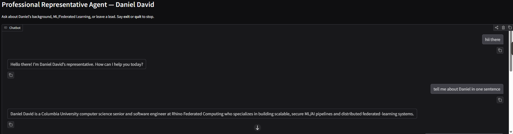
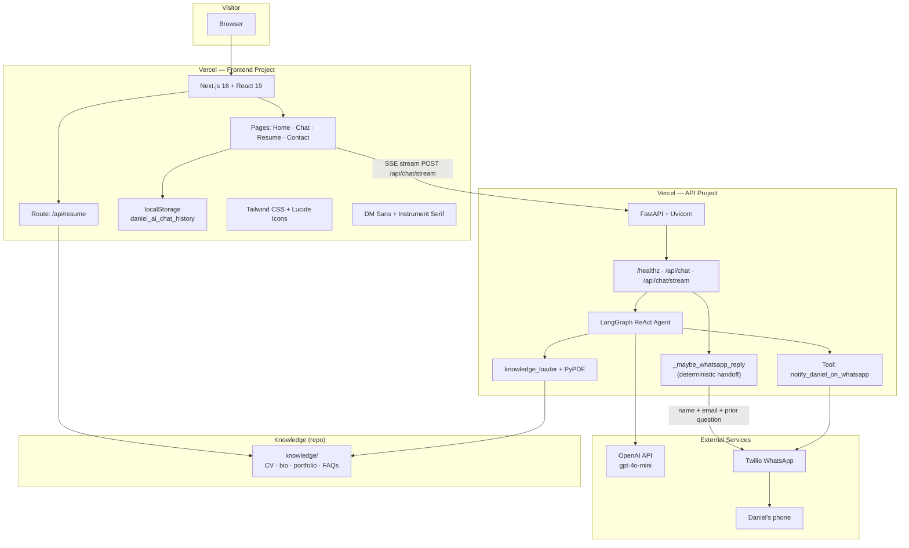
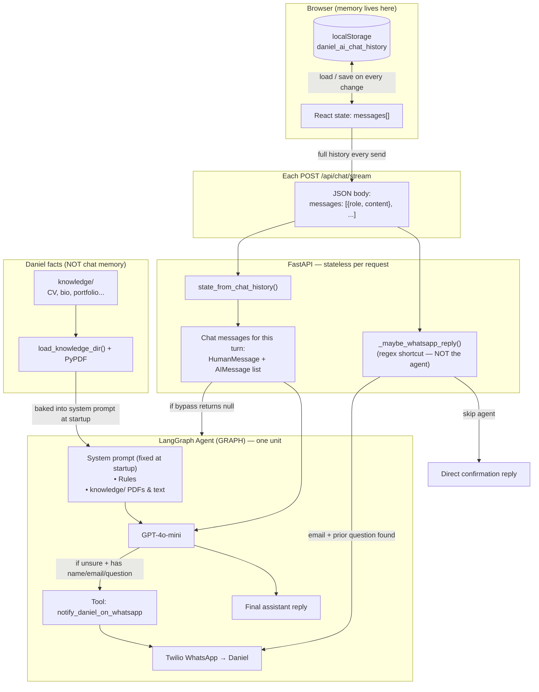
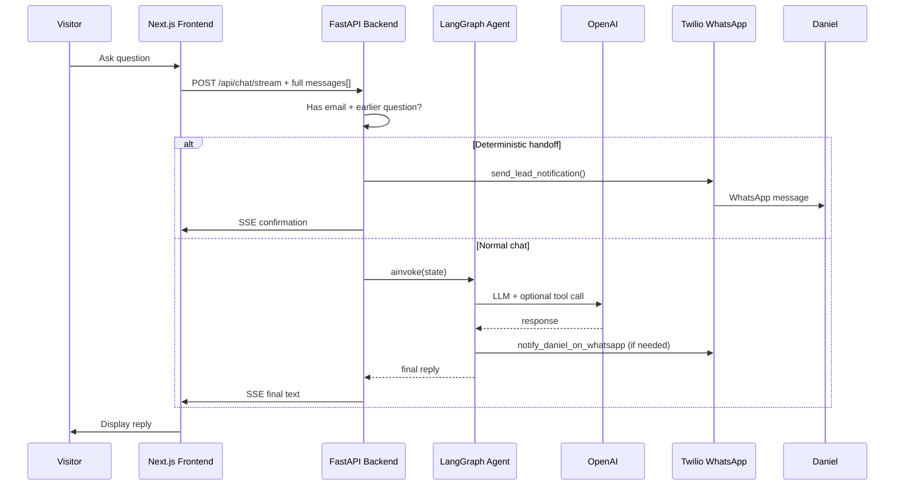

# Professional AI Representative

Daniel David's professional AI gatekeeper — a Next.js portfolio site with a LangGraph-powered chat agent that answers from a knowledge base and notifies Daniel on WhatsApp when it cannot answer.



## What it does

- **Public persona** — Answers questions about Daniel's background, skills, and projects from files in `knowledge/`.
- **Missing-info protocol** — When unsure (salary, private details, predictions, etc.), collects name + email and notifies Daniel via **Twilio WhatsApp**.
- **Full-stack deployment** — Next.js frontend and FastAPI backend, both deployable on Vercel.

## Live stack

| Layer | Tech |
|-------|------|
| Frontend | Next.js 16, Tailwind CSS |
| Backend | FastAPI, LangGraph, LangChain OpenAI |
| LLM | OpenAI API (`gpt-4o-mini`) |
| Lead alerts | Twilio WhatsApp |
| Knowledge | `knowledge/` — `.txt`, `.md`, `.pdf` loaded at startup |

## Architecture

### System overview


```mermaid
flowchart TB
    subgraph User["Visitor"]
        Browser["Browser"]
    end

    subgraph VercelFE["Vercel — Frontend Project"]
        NextJS["Next.js 16 + React 19"]
        Pages["Pages: Home · Chat · Resume · Contact"]
        ResumeAPI["Route: /api/resume"]
        LS["localStorage<br/>daniel_ai_chat_history"]
        Tailwind["Tailwind CSS + Lucide Icons"]
        Fonts["DM Sans + Instrument Serif"]
    end

    subgraph VercelAPI["Vercel — API Project"]
        FastAPI["FastAPI + Uvicorn"]
        Routes["/healthz · /api/chat · /api/chat/stream"]
        Handoff["_maybe_whatsapp_reply<br/>(deterministic handoff)"]
        Agent["LangGraph ReAct Agent"]
        Tool["Tool: notify_daniel_on_whatsapp"]
        Loader["knowledge_loader + PyPDF"]
    end

    subgraph External["External Services"]
        OpenAI["OpenAI API<br/>gpt-4o-mini"]
        Twilio["Twilio WhatsApp"]
        Daniel["Daniel's phone"]
    end

    subgraph Data["Knowledge (repo)"]
        Knowledge["knowledge/<br/>CV · bio · portfolio · FAQs"]
    end

    Browser --> NextJS
    NextJS --> Pages
    NextJS --> ResumeAPI
    Pages --> LS
    Pages -->|"SSE stream POST /api/chat/stream"| FastAPI
    ResumeAPI --> Knowledge

    FastAPI --> Routes
    Routes --> Handoff
    Handoff -->|"name + email + prior question"| Twilio
    Routes --> Agent
    Agent --> OpenAI
    Agent --> Tool
    Tool --> Twilio
    Loader --> Knowledge
    Agent --> Loader
    Twilio --> Daniel
```

### Agent unit + all context sources

How the **LangGraph agent** fits together: where chat memory lives (browser), what context it receives each request (system prompt vs. messages), and when tools run.


```mermaid
flowchart TB
    subgraph Browser["Browser (memory lives here)"]
        LS[("localStorage<br/>daniel_ai_chat_history")]
        ReactState["React state: messages[]"]
        LS <-->|load / save on every change| ReactState
    end

    subgraph Request["Each POST /api/chat/stream"]
        Payload["JSON body:<br/>messages: [{role, content}, ...]"]
    end

    subgraph Backend["FastAPI — stateless per request"]
        Convert["state_from_chat_history()"]
        ChatMsgs["Chat messages for this turn:<br/>HumanMessage + AIMessage list"]
        Bypass["_maybe_whatsapp_reply()<br/>(regex shortcut — NOT the agent)"]
    end

    subgraph AgentUnit["LangGraph Agent (GRAPH) — one unit"]
        direction TB
        SP["System prompt (fixed at startup)<br/>• Rules<br/>• knowledge/ PDFs & text"]
        LLM["GPT-4o-mini"]
        Tool["Tool: notify_daniel_on_whatsapp"]
        SP --> LLM
        ChatMsgs --> LLM
        LLM -->|"if unsure + has name/email/question"| Tool
        Tool --> Twilio["Twilio WhatsApp → Daniel"]
        LLM --> Reply["Final assistant reply"]
    end

    subgraph Knowledge["Daniel facts (NOT chat memory)"]
        KDir["knowledge/<br/>CV, bio, portfolio..."]
        KLoader["load_knowledge_dir() + PyPDF"]
        KDir --> KLoader
        KLoader -->|"baked into system prompt at startup"| SP
    end

    ReactState -->|"full history every send"| Payload
    Payload --> Convert
    Convert --> ChatMsgs
    Payload --> Bypass
    Bypass -->|"email + prior question found"| Twilio
    Bypass -->|"skip agent"| DirectReply["Direct confirmation reply"]
    ChatMsgs -->|"if bypass returns null"| AgentUnit
```

### Chat request flow


```mermaid
sequenceDiagram
    participant U as Visitor
    participant FE as Next.js Frontend
    participant BE as FastAPI Backend
    participant LG as LangGraph Agent
    participant OAI as OpenAI
    participant WA as Twilio WhatsApp
    participant D as Daniel

    U->>FE: Ask question
    FE->>BE: POST /api/chat/stream + full messages[]
    BE->>BE: Has email + earlier question?
    alt Deterministic handoff
        BE->>WA: send_lead_notification()
        WA->>D: WhatsApp message
        BE->>FE: SSE confirmation
    else Normal chat
        BE->>LG: ainvoke(state)
        LG->>OAI: LLM + optional tool call
        OAI-->>LG: response
        LG->>WA: notify_daniel_on_whatsapp (if needed)
        LG-->>BE: final reply
        BE->>FE: SSE final text
    end
    FE->>U: Display reply
```

## Quick start (local)

See **[DEVELOPER_INSTRUCTIONS.md](DEVELOPER_INSTRUCTIONS.md)** for the full guide.

```bash
# Backend
python3 -m venv .venv && source .venv/bin/activate
pip install -r requirements.txt
cp .env.example .env   # fill in OPENAI_API_KEY and Twilio vars
uvicorn backend.app:app --host 0.0.0.0 --port 8000

# Frontend (separate terminal)
cd frontend && npm install && npm run dev
```

Open `http://localhost:3000/chat`.

## Environment variables

Copy `.env.example` to `.env` at the repo root:

| Variable | Where | Purpose |
|----------|-------|---------|
| `OPENAI_API_KEY` | Backend | LLM calls |
| `OPENAI_MODEL` | Backend | Optional, default `gpt-4o-mini` |
| `TWILIO_ACCOUNT_SID` | Backend | WhatsApp lead notifications |
| `TWILIO_AUTH_TOKEN` | Backend | WhatsApp lead notifications |
| `TWILIO_WHATSAPP_FROM` | Backend | Twilio sandbox or business sender |
| `TWILIO_WHATSAPP_TO` | Backend | Daniel's WhatsApp number |
| `NEXT_PUBLIC_API_URL` | Frontend | Backend URL, e.g. `http://localhost:8000` |

Never commit `.env`. Never put secrets in `NEXT_PUBLIC_*`.

## Project structure

```
backend/
  app.py          FastAPI routes (/healthz, /api/chat, /api/chat/stream)
  agent.py        LangGraph react agent + WhatsApp tool
  whatsapp.py     Twilio send helpers
frontend/
  app/            Next.js pages (home, chat, resume, contact)
  app/api/resume/ Serves CV PDF from knowledge/
knowledge/        Agent context — resume, bio, FAQs (loaded at startup)
custom/           Legacy Gradio + Azure OpenAI Agents SDK path (optional)
api/index.py      Vercel serverless entry for backend deployment
```

## Deployment (production)

Two **separate Vercel projects**:

1. **API** — Root directory `.`, uses `vercel.json` → `api/index.py`
   - Set all backend env vars (`OPENAI_*`, `TWILIO_*`)
2. **Frontend** — Root directory `frontend/`
   - Set `NEXT_PUBLIC_API_URL=https://<your-api-domain>`

Verify backend: `curl https://<api-domain>/healthz`

## Knowledge directory

Drop `.txt`, `.md`, or `.pdf` files into `knowledge/` (resume, bio, FAQs). The agent loads them at startup. `knowledge/README.md` and `knowledge/response-guidelines.md` are instructions only — not loaded as persona content.

Current resume: `knowledge/Daniel_David_CV_May_2026_Har.pdf`

## Legacy path

The `custom/` folder contains an earlier implementation using the OpenAI Agents SDK, Azure OpenAI, SendGrid, and Gradio (`python custom/main.py` or `custom/app_gradio.py`). The production app uses `backend/` + `frontend/` instead.

## License

Personal portfolio project — Daniel David.
