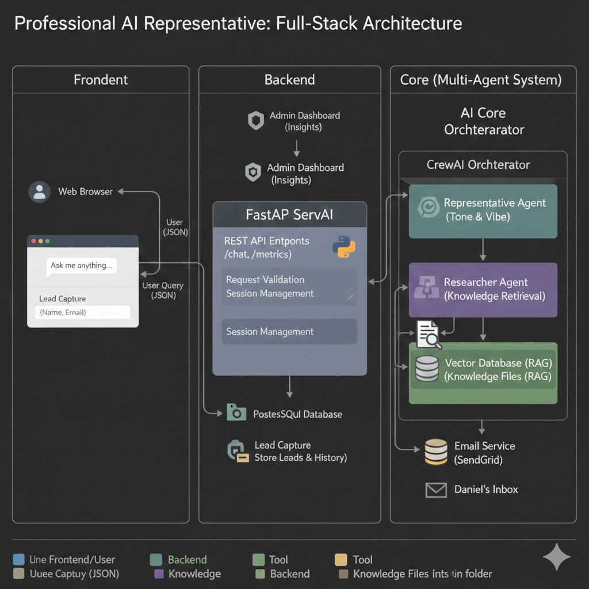

# Project Vision: The Professional Digital Representative

## The Mission

Bridge the gap between static professional profiles (LinkedIn/CVs) and meaningful connection through an **autonomous agentic gateway**. This is a "Digital Alter-Ego" that represents Daniel's technical persona, protects focus, and captures high-value opportunities with 24/7 reliability.

## Current State (shipped)

The production app is live as a **Next.js frontend + FastAPI/LangGraph backend**, deployed on Vercel.

| Feature | Implementation |
|---------|----------------|
| Persona & knowledge | `knowledge/` directory (CV, bio, FAQs) loaded at startup |
| Chat agent | LangGraph react agent with OpenAI `gpt-4o-mini` |
| Missing-info protocol | Collect name + email → notify Daniel on **Twilio WhatsApp** |
| Frontend | Portfolio home, chat, resume viewer, contact form |
| Conversation memory | Browser `localStorage` + full history sent to API |

### Architecture

## Roadmap

### Phase 1 — Intelligent Brain ✅
- Agentic tool use with LangGraph
- Grounded answers from `knowledge/`; no hallucination on unknowns
- Real-world lead capture via WhatsApp

### Phase 2 — Deeper retrieval (future)
- RAG over GitHub repos and technical papers
- Persistent conversation memory (database)
- Specialist sub-agents for research vs. representation

### Phase 3 — Production ecosystem (partial ✅)
- FastAPI REST + SSE streaming ✅
- Next.js frontend ✅
- Future: MCP integration for live GitHub activity, analytics on visitor questions

## Engineering Principles

1. **Grounded truth** — If not sure, escalate to Daniel; never invent salary, private, or unverified details.
2. **Safety first** — Prompt guardrails; ML Security background applied to agent design.
3. **Simplicity** — One LLM, one WhatsApp tool, one deterministic handoff hook for reliable lead capture.
4. **Observability** — Health checks, test endpoints, clear error messages for deployment debugging.

## About Daniel

Columbia University graduate (B.A. Computer Science, May 2026). Former ML Engineer at Rhino Federated Computing. Focus areas: Federated Learning, ML Security, agentic AI, production ML pipelines. Currently open to full-time ML/AI engineering roles.

---

*Developed as part of the 2026 AI Agentic Workflow Specialization.*
